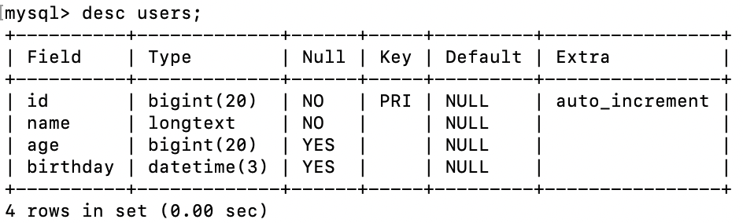

## 01.创建

### 1.0 生成表

```go
package main

import (
	"time"

	"gorm.io/driver/mysql"
	"gorm.io/gorm"
)

// User 表的结构体ORM映射
type User struct {
	Id       int64      `json:"id" gorm:"primary_key"`
	Name     string     `json:"name" gorm:"not null" bind:"required"`
	Age      int        `json:"age"`
	Birthday *time.Time `json:"birthday" gorm:"column:birthday"`
}

func main() {
	// 1、连接数据库
	dsn := "root:1@tcp(127.0.0.1:3306)/test_db?charset=utf8mb4&parseTime=True&loc=Local"
	db, _ := gorm.Open(mysql.Open(dsn), &gorm.Config{})

	// 2、自动创建表
	db.AutoMigrate(
		User{},
	)
}
```

- 生成字段如下

 

### 1.1 创建和批量创建

```go
package main

import (
	"fmt"
	"time"

	"gorm.io/driver/mysql"
	"gorm.io/gorm"
)

// User 表的结构体ORM映射
type User struct {
	ID       int64     `json:"id" gorm:"primary_key"`
	Name     string    `json:"name" gorm:"not null" bind:"required"`
	Age      int       `json:"age"`
	Birthday time.Time `json:"birthday" gorm:"column:birthday"`
}

func main() {
	// 0、连接数据库
	dsn := "root:1@tcp(127.0.0.1:3306)/test_db?charset=utf8mb4&parseTime=True&loc=Local"
	db, _ := gorm.Open(mysql.Open(dsn), &gorm.Config{})

	// 1、创建记录
	user := User{Name: "Jinzhu", Age: 18, Birthday: time.Now()}
	result := db.Create(&user) // 通过数据的指针来创建
	
	fmt.Println(user.ID)             // 返回插入数据的主键
	fmt.Println(result.Error)        // 返回 error
	fmt.Println(result.RowsAffected) // 返回插入记录的条数

	// 2、用指定的字段创建记录 （创建记录并更新给出的字段）Birthday字段不会有数据
	user := User{Name: "Jinzhu", Age: 18, Birthday: time.Now()}
	db.Select("Name", "Age").Create(&user)

	// 3、批量插入
	var users = []User{{Name: "jinzhu1", Birthday: time.Now()},
		{Name: "jinzhu2", Birthday: time.Now()},
		{Name: "jinzhu3", Birthday: time.Now()}}
	db.Create(&users)

}
```

### 1.2 根据 Map 创建

- GORM 支持根据 `map[string]interface{}` 和 `[]map[string]interface{}{}` 创建记录

```go
package main

import (
	"time"

	"gorm.io/driver/mysql"
	"gorm.io/gorm"
)

// User 表的结构体ORM映射
type User struct {
	ID       int64     `json:"id" gorm:"primary_key"`
	Name     string    `json:"name" gorm:"not null" bind:"required"`
	Age      int       `json:"age"`
	Birthday time.Time `json:"birthday" gorm:"column:birthday"`
}

func main() {
	// 0、连接数据库
	dsn := "root:1@tcp(127.0.0.1:3306)/test_db?charset=utf8mb4&parseTime=True&loc=Local"
	db, _ := gorm.Open(mysql.Open(dsn), &gorm.Config{})

	// 1、map[string]interface{} 创建
	db.Model(&User{}).Create(map[string]interface{}{
		"Name": "jinzhu", "Age": 18,
	})

	// 2、[]map[string]interface{}{} 创建
	db.Model(&User{}).Create([]map[string]interface{}{
		{"Name": "jinzhu_1", "Age": 18},
		{"Name": "jinzhu_2", "Age": 20},
	})

}
```

### 1.3 创建钩子

- GORM 允许用户定义的钩子有 `BeforeSave`, `BeforeCreate`, `AfterSave`, `AfterCreate` 
- 创建记录时将调用这些钩子方法，请参考 [Hooks](https://gorm.io/zh_CN/docs/hooks.html) 中关于生命周期的详细信息

```go
package main

import (
	"errors"
	"fmt"
	"time"

	"gorm.io/driver/mysql"
	"gorm.io/gorm"
)

// User 表的结构体ORM映射
type User struct {
	ID       int64     `json:"id" gorm:"primary_key"`
	Name     string    `json:"name" gorm:"not null" bind:"required"`
	Age      int       `json:"age"`
	Birthday time.Time `json:"birthday" gorm:"column:birthday"`
}

func main() {
	// 0、连接数据库
	dsn := "root:1@tcp(127.0.0.1:3306)/test_db?charset=utf8mb4&parseTime=True&loc=Local"
	db, _ := gorm.Open(mysql.Open(dsn), &gorm.Config{})

	// 1、创建记录
	user := User{Name: "admin", Age: 18, Birthday: time.Now()}
	if err := db.Create(&user); err != nil {
		fmt.Println(err.Error) // 不能创建admin用户

	}

}

func (u *User) BeforeCreate(tx *gorm.DB) (err error) {
	if u.Name == "admin" {
		return errors.New("不能创建admin用户")
	}
	return
}
```

### 1.4 默认值

- 1）插入记录到数据库时，默认值 *会被用于* 填充值为 [零值](https://tour.golang.org/basics/12) 的字段

```go
type User struct {
  ID   int64
  Name string `gorm:"default:galeone"`
  Age  int64  `gorm:"default:18"`
}
```

- 注1：对于声明了默认值的字段，像 `0`、`''`、`false` 等零值是不会保存到数据库。
  - 您需要使用指针类型或 Scanner/Valuer 来避免这个问题

```go
type User struct {
  gorm.Model
  Name string
  Age  *int           `gorm:"default:18"`
  Active sql.NullBool `gorm:"default:true"`
}
```

## 02.查询

- [查询](https://gorm.io/zh_CN/docs/query.html)

### 2.1 简单查询

```go
package main

import (
	"errors"
	"fmt"
	"time"

	"gorm.io/driver/mysql"
	"gorm.io/gorm"
)

// User 表的结构体ORM映射
type User struct {
	ID       int64     `json:"id" gorm:"primary_key"`
	Name     string    `json:"name" gorm:"not null" bind:"required"`
	Age      int       `json:"age"`
	Birthday time.Time `json:"birthday" gorm:"column:birthday"`
}

func main() {
	// 0、连接数据库
	dsn := "root:1@tcp(127.0.0.1:3306)/test_db?charset=utf8mb4&parseTime=True&loc=Local"
	db, _ := gorm.Open(mysql.Open(dsn), &gorm.Config{})

	// 1、检索单个对象：获取第一条记录（主键升序）
	var user User
	db.First(&user) // SELECT * FROM users ORDER BY id LIMIT 1;
	
	// 2、获取一条记录，没有指定排序字段
	var user User
	db.Take(&user) // SELECT * FROM users LIMIT 1;
	
	// 3、获取最后一条记录（主键降序）
	var user User
	db.Last(&user) // SELECT * FROM users ORDER BY id DESC LIMIT 1;
	
	// 4、获取影响
	var user User
	result := db.First(&user)
	fmt.Println(result.RowsAffected)                             // 返回找到的记录数
	fmt.Println(result.Error)                                    // returns error or nil
  // 当 First、Last、Take 方法找不到记录时，GORM 会返回 ErrRecordNotFound 错误
	fmt.Println(errors.Is(result.Error, gorm.ErrRecordNotFound)) // 检查 ErrRecordNotFound 错误
	
	//// 5、主键检索
	var user User
	// 5.1 // SELECT * FROM users WHERE id = 10;
	db.First(&user, 10)
	
	// 5.2 SELECT * FROM users WHERE id = 10;
	db.First(&user, "10")
	
	// 5.3 SELECT * FROM users WHERE id IN (1,2,3);
	var users []User
	db.Find(&users, []int{1, 2, 3})

	// 6.获取全部记录：SELECT * FROM users;
	var users []User
	result := db.Find(&users)
	fmt.Println(result.RowsAffected) // 返回找到的记录数，相当于 `len(users)`
	fmt.Println(result.Error)        // returns error
	// 遍历全部记录
	for _, u := range users {
		fmt.Println(u.ID, u.Name, u.Age)
	}
}
```

### 2.2 String 条件

```go
package main

import (
	"time"

	"gorm.io/driver/mysql"
	"gorm.io/gorm"
)

// User 表的结构体ORM映射
type User struct {
	ID       int64     `json:"id" gorm:"primary_key"`
	Name     string    `json:"name" gorm:"not null" bind:"required"`
	Age      int       `json:"age"`
	Birthday time.Time `json:"birthday" gorm:"column:birthday"`
}

func main() {
	// 0、连接数据库
	dsn := "root:1@tcp(127.0.0.1:3306)/test_db?charset=utf8mb4&parseTime=True&loc=Local"
	db, _ := gorm.Open(mysql.Open(dsn), &gorm.Config{})

	// 1、获取第一条匹配的记录
	// SELECT * FROM users WHERE name = 'jinzhu' ORDER BY id LIMIT 1;
	var user User
	db.Where("name = ?", "jinzhu").First(&user)

	// 2、获取全部匹配的记录(查找用户名不等于"jinzhu"的用户)
	// SELECT * FROM users WHERE name <> 'jinzhu';
	var users []User
	db.Where("name <> ?", "jinzhu").Find(&users)

	// 3、IN
	// SELECT * FROM users WHERE name IN ('jinzhu','jinzhu 2');
	var users []User
	db.Where("name IN ?", []string{"jinzhu1", "jinzhu2"}).Find(&users)

	// 4、LIKE
	// SELECT * FROM users WHERE name LIKE '%jin%';
	var users []User
	db.Where("name LIKE ?", "%jin%").Find(&users)

	// 5、AND
	// SELECT * FROM users WHERE name = 'jinzhu' AND age >= 22;
	var users []User
	db.Where("name = ? AND age >= ?", "jinzhu", "22").Find(&users)

	// 5、Time  查找在 2022-03-17 14:00:00 后创建的所有用户
	// SELECT * FROM users WHERE updated_at > '2022-03-17 14:00:00';
	var users []User
	loc, _ := time.LoadLocation("Asia/Shanghai")
	timeObj, _ := time.ParseInLocation("2006-01-02 15:04:05", "2022-03-17 14:00:00", loc)
	db.Where("birthday > ?", timeObj).Find(&users)

	// 6、BETWEEN 查找在下午 14:00到15:00之间创建的用户
	// SELECT * FROM users WHERE created_at BETWEEN '2000-01-01 00:00:00' AND '2000-01-08 00:00:00';
	var users []User
	loc, _ := time.LoadLocation("Asia/Shanghai")
	startTime, _ := time.ParseInLocation("2006-01-02 15:04:05", "2022-03-17 14:00:00", loc)
	endTime, _ := time.ParseInLocation("2006-01-02 15:04:05", "2022-03-17 15:00:00", loc)
	db.Where("birthday BETWEEN ? AND ?", startTime, endTime).Find(&users)
}
```

### 2.3 Struct&Map条件

```go
package main

import (
	"fmt"
	"time"

	"gorm.io/driver/mysql"
	"gorm.io/gorm"
)

// User 表的结构体ORM映射
type User struct {
	ID       int64     `json:"id" gorm:"primary_key"`
	Name     string    `json:"name" gorm:"not null" bind:"required"`
	Age      int       `json:"age"`
	Birthday time.Time `json:"birthday" gorm:"column:birthday"`
}

func main() {
	// 0、连接数据库
	dsn := "root:1@tcp(127.0.0.1:3306)/test_db?charset=utf8mb4&parseTime=True&loc=Local"
	db, _ := gorm.Open(mysql.Open(dsn), &gorm.Config{})

	// 1、Struct
	// SELECT * FROM users WHERE name = "jinzhu" AND age = 20 ORDER BY id LIMIT 1;
	var user User
	db.Where(&User{Name: "Jinzhu", Age: 18}).First(&user)

	// 2、Map
	// SELECT * FROM users WHERE name = "jinzhu" AND age = 20;
	var users []User
	db.Where(map[string]interface{}{"name": "Jinzhu", "age": 18}).Find(&users)
	fmt.Println(users)

	// 3、主键切片条件
	// SELECT * FROM users WHERE id IN (20, 21, 22);
	var users []User
	db.Where([]int64{20, 21, 22}).Find(&users)
}
```

### 2.4 内联条件

- 查询条件也可以被内联到 `First` 和 `Find` 之类的方法中，其用法类似于 `Where`。

```go
// 根据主键获取记录，如果是非整型主键
db.First(&user, "id = ?", "string_primary_key")
// SELECT * FROM users WHERE id = 'string_primary_key';

// Plain SQL
db.Find(&user, "name = ?", "jinzhu")
// SELECT * FROM users WHERE name = "jinzhu";

db.Find(&users, "name <> ? AND age > ?", "jinzhu", 20)
// SELECT * FROM users WHERE name <> "jinzhu" AND age > 20;

// Struct
db.Find(&users, User{Age: 20})
// SELECT * FROM users WHERE age = 20;

// Map
db.Find(&users, map[string]interface{}{"age": 20})
// SELECT * FROM users WHERE age = 20;
```

### 2.5 Not 条件

构建 NOT 条件，用法与 `Where` 类似

```go
db.Not("name = ?", "jinzhu").First(&user)
// SELECT * FROM users WHERE NOT name = "jinzhu" ORDER BY id LIMIT 1;

// Not In
db.Not(map[string]interface{}{"name": []string{"jinzhu", "jinzhu 2"}}).Find(&users)
// SELECT * FROM users WHERE name NOT IN ("jinzhu", "jinzhu 2");

// Struct
db.Not(User{Name: "jinzhu", Age: 18}).First(&user)
// SELECT * FROM users WHERE name <> "jinzhu" AND age <> 18 ORDER BY id LIMIT 1;

// 不在主键切片中的记录
db.Not([]int64{1,2,3}).First(&user)
// SELECT * FROM users WHERE id NOT IN (1,2,3) ORDER BY id LIMIT 1;
```

### 2.6 Or 条件

```go
db.Where("role = ?", "admin").Or("role = ?", "super_admin").Find(&users)
// SELECT * FROM users WHERE role = 'admin' OR role = 'super_admin';

// Struct
db.Where("name = 'jinzhu'").Or(User{Name: "jinzhu 2", Age: 18}).Find(&users)
// SELECT * FROM users WHERE name = 'jinzhu' OR (name = 'jinzhu 2' AND age = 18);

// Map
db.Where("name = 'jinzhu'").Or(map[string]interface{}{"name": "jinzhu 2", "age": 18}).Find(&users)
// SELECT * FROM users WHERE name = 'jinzhu' OR (name = 'jinzhu 2' AND age = 18);
```

### 2.7 选择特定字段

```go
package main

import (
	"encoding/json"
	"fmt"
	"time"

	"gorm.io/driver/mysql"
	"gorm.io/gorm"
)

// User 表的结构体ORM映射
type User struct {
	ID       int64     `json:"id" gorm:"primary_key"`
	Name     string    `json:"name" gorm:"not null" bind:"required"`
	Age      int       `json:"age"`
	Birthday time.Time `json:"birthday" gorm:"column:birthday"`
}

func main() {
	// 0、连接数据库
	dsn := "root:1@tcp(127.0.0.1:3306)/test_db?charset=utf8mb4&parseTime=True&loc=Local"
	db, _ := gorm.Open(mysql.Open(dsn), &gorm.Config{})

	// 1、查询指定字段，未指定字段补nil，但是也显示
	// SELECT name, age FROM users;
	var users []User
	//db.Select("name", "age").Find(&users)
	db.Select([]string{"name", "age"}).Find(&users)
	strUsers, _ := json.Marshal(users)
	fmt.Println(string(strUsers))
	//[{"id":0,"name":"zhangsan","age":24,"birthday":"0001-01-01T00:00:00Z"}, ...]

	// 2、使用新的Result来只显示指定字段
	type Result struct {
		Name string `json:"name"`
		Age  int    `json:"age"`
	}
	var result []Result
	db.Table("users").Select("name, age").Scan(&result)
	strUsers, _ := json.Marshal(result)
	fmt.Println(string(strUsers))
	// [{"name":"zhangsan","age":24},{"name":"zhangsan2","age":25}]
}
```

- 数据

```json
[
    {
        "id":0,
        "name":"Jinzhu",
        "age":18,
        "birthday":"0001-01-01T00:00:00Z"
    },
]
```

### 2.8 Order

- 指定从数据库检索记录时的排序方式

```go
db.Order("age desc, name").Find(&users)
// SELECT * FROM users ORDER BY age desc, name;

// 多个 order
db.Order("age desc").Order("name").Find(&users)
// SELECT * FROM users ORDER BY age desc, name;

db.Clauses(clause.OrderBy{
  Expression: clause.Expr{SQL: "FIELD(id,?)", Vars: []interface{}{[]int{1, 2, 3}}, WithoutParentheses: true},
}).Find(&User{})
// SELECT * FROM users ORDER BY FIELD(id,1,2,3)
```

### 2.9 Limit&Offset

- `Limit` 指定获取记录的最大数量 `Offset` 指定在开始返回记录之前要跳过的记录数量

```go
db.Limit(3).Find(&users)
// SELECT * FROM users LIMIT 3;

// 通过 -1 消除 Limit 条件
db.Limit(10).Find(&users1).Limit(-1).Find(&users2)
// SELECT * FROM users LIMIT 10; (users1)
// SELECT * FROM users; (users2)

db.Offset(3).Find(&users)
// SELECT * FROM users OFFSET 3;

db.Limit(10).Offset(5).Find(&users)
// SELECT * FROM users OFFSET 5 LIMIT 10;

// 通过 -1 消除 Offset 条件
db.Offset(10).Find(&users1).Offset(-1).Find(&users2)
// SELECT * FROM users OFFSET 10; (users1)
// SELECT * FROM users; (users2)
```

### 2.10 Distinct

- 从模型中选择不相同的值
- `Distinct` 也可以配合 [`Pluck`](https://gorm.io/zh_CN/docs/advanced_query.html#pluck), [`Count`](https://gorm.io/zh_CN/docs/advanced_query.html#count) 使用

```go
db.Distinct("name", "age").Order("name, age desc").Find(&results)
```

2.11 

## 03.其他查询

### 3.1 Group By & Having

```go
type result struct {
  Date  time.Time
  Total int
}

db.Model(&User{}).Select("name, sum(age) as total").Where("name LIKE ?", "group%").Group("name").First(&result)
// SELECT name, sum(age) as total FROM `users` WHERE name LIKE "group%" GROUP BY `name` LIMIT 1


db.Model(&User{}).Select("name, sum(age) as total").Group("name").Having("name = ?", "group").Find(&result)
// SELECT name, sum(age) as total FROM `users` GROUP BY `name` HAVING name = "group"

rows, err := db.Table("orders").Select("date(created_at) as date, sum(amount) as total").Group("date(created_at)").Rows()
for rows.Next() {
  ...
}

rows, err := db.Table("orders").Select("date(created_at) as date, sum(amount) as total").Group("date(created_at)").Having("sum(amount) > ?", 100).Rows()
for rows.Next() {
  ...
}

type Result struct {
  Date  time.Time
  Total int64
}
db.Table("orders").Select("date(created_at) as date, sum(amount) astotal")
.Group("date(created_at)").Having("sum(amount) > ?", 100).Scan(&results)
```

### 3.2 Joins

指定 Joins 条件

```go
type result struct {
  Name  string
  Email string
}

db.Model(&User{}).Select("users.name, emails.email")
.Joins("left join emails on emails.user_id = users.id").Scan(&result{})
// SELECT users.name, emails.email FROM `users` left join emails on emails.user_id = users.id

rows, err := db.Table("users").Select("users.name, emails.email")
.Joins("left join emails on emails.user_id = users.id").Rows()

for rows.Next() {
  ...
}

db.Table("users").Select("users.name, emails.email")
.Joins("left join emails on emails.user_id = users.id").Scan(&results)

// 带参数的多表连接
db.Joins("JOIN emails ON emails.user_id = users.id AND emails.email = ?", "jinzhu@example.org")
.Joins("JOIN credit_cards ON credit_cards.user_id = users.id")
.Where("credit_cards.number = ?", "411111111111").Find(&user)
```

## 04.高级查询

### 4.1 子查询

```go
package main

import (
	"time"

	"gorm.io/driver/mysql"
	"gorm.io/gorm"
)

// User 表的结构体ORM映射
type User struct {
	ID       int64     `json:"id" gorm:"primary_key"`
	Name     string    `json:"name" gorm:"not null" bind:"required"`
	Age      int       `json:"age"`
	Birthday time.Time `json:"birthday" gorm:"column:birthday"`
}

func main() {
	// 0、连接数据库
	dsn := "root:1@tcp(127.0.0.1:3306)/test_db?charset=utf8mb4&parseTime=True&loc=Local"
	db, _ := gorm.Open(mysql.Open(dsn), &gorm.Config{})

	// 1、子查询
	// SELECT * FROM "users" WHERE age > (SELECT AVG(age) FROM "users");
	var users []User
	db.Where("age > (?)", db.Table("users").Select("AVG(age)")).Find(&users)
}
```

### 4.2 Where条件

```go
package main

import (
	"time"

	"gorm.io/driver/mysql"
	"gorm.io/gorm"
)

// User 表的结构体ORM映射
type User struct {
	ID       int64     `json:"id" gorm:"primary_key"`
	Name     string    `json:"name" gorm:"not null" bind:"required"`
	Age      int       `json:"age"`
	Birthday time.Time `json:"birthday" gorm:"column:birthday"`
}

func main() {
	// 0、连接数据库
	dsn := "root:1@tcp(127.0.0.1:3306)/test_db?charset=utf8mb4&parseTime=True&loc=Local"
	db, _ := gorm.Open(mysql.Open(dsn), &gorm.Config{})

	// 1、and条件
	// SELECT * FROM "users" WHERE name = "jinzhu" and age = 18;
	var users []User
	db.Where(db.Where("name = ?", "jinzhu").Where(db.Where("age = ?", "18"))).Find(&users)

	// 2、or条件
	// SELECT * FROM "users" WHERE name = "jinzhu" or age = 20;
	var users []User
	db.Where(db.Where("name = ?", "jinzhu")).Or(db.Where("age = ?", "20")).Find(&users)
}
```

### 4.3 带多个列的 In

```go
package main

import (
	"time"

	"gorm.io/driver/mysql"
	"gorm.io/gorm"
)

// User 表的结构体ORM映射
type User struct {
	ID       int64     `json:"id" gorm:"primary_key"`
	Name     string    `json:"name" gorm:"not null" bind:"required"`
	Age      int       `json:"age"`
	Birthday time.Time `json:"birthday" gorm:"column:birthday"`
}

func main() {
	// 0、连接数据库
	dsn := "root:1@tcp(127.0.0.1:3306)/test_db?charset=utf8mb4&parseTime=True&loc=Local"
	db, _ := gorm.Open(mysql.Open(dsn), &gorm.Config{})

	// 1、多个in条件
	var users []User
	db.Where("(name, age) IN ?", [][]interface{}{{"jinzhu", 18}, {"jinzhu_2", 20}}).Find(&users)
	// SELECT * FROM users WHERE (name, age) IN (("jinzhu", 18,), ("jinzhu_2", 20));
}
```

### 4.4 命名参数

```go
db.Where("name1 = @name OR name2 = @name", sql.Named("name", "jinzhu")).Find(&user)
// SELECT * FROM `users` WHERE name1 = "jinzhu" OR name2 = "jinzhu"

db.Where("name1 = @name OR name2 = @name", map[string]interface{}{"name": "jinzhu"}).First(&user)
// SELECT * FROM `users` WHERE name1 = "jinzhu" OR name2 = "jinzhu" ORDER BY `users`.`id` LIMIT 1
```

### 4.5  Find至map

```go
package main

import (
	"fmt"
	"time"

	"gorm.io/driver/mysql"
	"gorm.io/gorm"
)

// User 表的结构体ORM映射
type User struct {
	ID       int64     `json:"id" gorm:"primary_key"`
	Name     string    `json:"name" gorm:"not null" bind:"required"`
	Age      int       `json:"age"`
	Birthday time.Time `json:"birthday" gorm:"column:birthday"`
}

func main() {
	// 0、连接数据库
	dsn := "root:1@tcp(127.0.0.1:3306)/test_db?charset=utf8mb4&parseTime=True&loc=Local"
	db, _ := gorm.Open(mysql.Open(dsn), &gorm.Config{})

	// 1、find一条数据到map
	result := map[string]interface{}{}
	db.Model(&User{}).First(&result, "id = ?", 8)
	fmt.Println(result["name"]) // jinzhu

	// 2、find所有匹配条件数据到map
	var results []map[string]interface{}
	db.Table("users").Find(&results)
	fmt.Println(results[0]["name"]) // jinzhu
}
```

### 4.6 FirstOrCreate

```go
// 未找到 user，则根据给定条件创建一条新纪录
db.FirstOrCreate(&user, User{Name: "non_existing"})
// INSERT INTO "users" (name) VALUES ("non_existing");
// user -> User{ID: 112, Name: "non_existing"}

// 找到了 `name` = `jinzhu` 的 user
db.Where(User{Name: "jinzhu"}).FirstOrCreate(&user)
// user -> User{ID: 111, Name: "jinzhu", "Age": 18}
```

### 4.7 迭代

```go
package main

import (
	"fmt"
	"time"

	"gorm.io/driver/mysql"
	"gorm.io/gorm"
)

// User 表的结构体ORM映射
type User struct {
	ID       int64     `json:"id" gorm:"primary_key"`
	Name     string    `json:"name" gorm:"not null" bind:"required"`
	Age      int       `json:"age"`
	Birthday time.Time `json:"birthday" gorm:"column:birthday"`
}

func main() {
	// 0、连接数据库
	dsn := "root:1@tcp(127.0.0.1:3306)/test_db?charset=utf8mb4&parseTime=True&loc=Local"
	db, _ := gorm.Open(mysql.Open(dsn), &gorm.Config{})

	rows, _ := db.Model(&User{}).Where("age > ?", "18").Rows()
	//defer rows.Close()
	for rows.Next() {
		var user User
		// ScanRows 方法用于将一行记录扫描至结构体
		db.ScanRows(rows, &user)

		// 业务逻辑...
		fmt.Println(user.Name)
	}

}
```

### 4.8 count

```go
package main

import (
	"fmt"
	"time"

	"gorm.io/driver/mysql"
	"gorm.io/gorm"
)

// User 表的结构体ORM映射
type User struct {
	ID       int64     `json:"id" gorm:"primary_key"`
	Name     string    `json:"name" gorm:"not null" bind:"required"`
	Age      int       `json:"age"`
	Birthday time.Time `json:"birthday" gorm:"column:birthday"`
}

func main() {
	// 0、连接数据库
	dsn := "root:1@tcp(127.0.0.1:3306)/test_db?charset=utf8mb4&parseTime=True&loc=Local"
	db, _ := gorm.Open(mysql.Open(dsn), &gorm.Config{})

	// 1、count
	var count int64
	db.Model(&User{}).Where("age > ?", "17").Count(&count)
	fmt.Println(count) // 3
}
```

## 05.更新

### 5.1 常用更新

```go
package main

import (
	"time"

	"gorm.io/driver/mysql"
	"gorm.io/gorm"
)

// User 表的结构体ORM映射
type User struct {
	ID       int64     `json:"id" gorm:"primary_key"`
	Name     string    `json:"name" gorm:"not null" bind:"required"`
	Age      int       `json:"age"`
	Birthday time.Time `json:"birthday" gorm:"column:birthday"`
}

func main() {
	// 0、连接数据库
	dsn := "root:1@tcp(127.0.0.1:3306)/test_db?charset=utf8mb4&parseTime=True&loc=Local"
	db, _ := gorm.Open(mysql.Open(dsn), &gorm.Config{})

	// 1、Save 会保存所有的字段，即使字段是零值
	var user User
	db.First(&user, 8)
	
	user.Name = "jinzhu_new"
	user.Birthday = time.Now()
	db.Save(&user)

	// 2、更新单个列
	// 2.1 条件更新
	db.Model(&User{}).Where("name = ?", "jinzhu_new").Update("name", "hello")

	// 2.2 根据条件和 model 的值进行更新
	user := User{
		Name: "hello",
	}
	db.Model(&user).Where("age = ?", "18").Update("name", "hello1")

	// 3、更新多个列
	var user User
	db.First(&user, 8).Updates(User{Name: "helloNew", Age: 14})

}
```

### 5.2 批量更新

```go
package main

import (
	"time"

	"gorm.io/driver/mysql"
	"gorm.io/gorm"
)

// User 表的结构体ORM映射
type User struct {
	ID       int64     `json:"id" gorm:"primary_key"`
	Name     string    `json:"name" gorm:"not null" bind:"required"`
	Age      int       `json:"age"`
	Birthday time.Time `json:"birthday" gorm:"column:birthday"`
}

func main() {
	// 0、连接数据库
	dsn := "root:1@tcp(127.0.0.1:3306)/test_db?charset=utf8mb4&parseTime=True&loc=Local"
	db, _ := gorm.Open(mysql.Open(dsn), &gorm.Config{})

	// 1、根据 struct 更新
	db.Model(User{}).Where("name = ?", "helloNew").Updates(User{Name: "hello", Age: 18})
	// UPDATE users SET name='hello', age=18 WHERE name = 'helloNew';

	// 根据 map 更新
	db.Table("users").Where("id IN ?", []int{9, 10}).Updates(map[string]interface{}{"name": "hello", "age": 18})
	// UPDATE users SET name='hello', age=18 WHERE id IN (9, 10);
}
```

## 06.删除

### 6.1 根据主键删除

```go
package main

import (
   "time"

   "gorm.io/driver/mysql"
   "gorm.io/gorm"
)

// User 表的结构体ORM映射
type User struct {
   ID       int64     `json:"id" gorm:"primary_key"`
   Name     string    `json:"name" gorm:"not null" bind:"required"`
   Age      int       `json:"age"`
   Birthday time.Time `json:"birthday" gorm:"column:birthday"`
}

func main() {
   // 0、连接数据库
   dsn := "root:1@tcp(127.0.0.1:3306)/test_db?charset=utf8mb4&parseTime=True&loc=Local"
   db, _ := gorm.Open(mysql.Open(dsn), &gorm.Config{})

   // 1、根据主键删除
   // 1.1 DELETE FROM users WHERE id = 10;
   db.Delete(&User{}, 10)
   
   // 1.2 DELETE FROM users WHERE id = 10;
   db.Delete(&User{}, "10")
   
   // 1.3 DELETE FROM users WHERE id IN (1,2,3);
   var users []User
   db.Delete(&users, []int{1,2,3})
}
```

### 6.2 批量删除

- 如果指定的值不包括主属性，那么 GORM 会执行批量删除，它将删除所有匹配的记录

```go
package main

import (
	"time"

	"gorm.io/driver/mysql"
	"gorm.io/gorm"
)

// User 表的结构体ORM映射
type User struct {
	ID       int64     `json:"id" gorm:"primary_key"`
	Name     string    `json:"name" gorm:"not null" bind:"required"`
	Age      int       `json:"age"`
	Birthday time.Time `json:"birthday" gorm:"column:birthday"`
}

func main() {
	// 0、连接数据库
	dsn := "root:1@tcp(127.0.0.1:3306)/test_db?charset=utf8mb4&parseTime=True&loc=Local"
	db, _ := gorm.Open(mysql.Open(dsn), &gorm.Config{})

	// 1、DELETE from users where name LIKE "%hello2%";
	db.Where("name LIKE ?", "%hello2%").Delete(&User{})
	db.Delete(&User{}, "name LIKE ?", "%hello2%")
}
```

## 07.原生 SQL

### 7.1 原始SQL

```go
package main

import (
	"fmt"
	"time"

	"gorm.io/driver/mysql"
	"gorm.io/gorm"
)

// User 表的结构体ORM映射
type User struct {
	ID       int64     `json:"id" gorm:"primary_key"`
	Name     string    `json:"name" gorm:"not null" bind:"required"`
	Age      int       `json:"age"`
	Birthday time.Time `json:"birthday" gorm:"column:birthday"`
}

func main() {
	// 0、连接数据库
	dsn := "root:1@tcp(127.0.0.1:3306)/test_db?charset=utf8mb4&parseTime=True&loc=Local"
	db, _ := gorm.Open(mysql.Open(dsn), &gorm.Config{})

	// 1、查询一条数据
	var user User
	db.Raw("SELECT id, name, age FROM users WHERE name = ?", "hello1").Scan(&user)
	fmt.Println(user.ID)

	// 2、查询多条数据
	var users []User
	db.Raw("select * from users").Scan(&users)
	fmt.Println(users[0].ID) // 8

}
```

### 7.2 DryRun

- 生成 `SQL` 但不执行。 它可以用于准备或测试生成的 SQL

```go
package main

import (
	"fmt"
	"time"

	"gorm.io/driver/mysql"
	"gorm.io/gorm"
)

// User 表的结构体ORM映射
type User struct {
	ID       int64     `json:"id" gorm:"primary_key"`
	Name     string    `json:"name" gorm:"not null" bind:"required"`
	Age      int       `json:"age"`
	Birthday time.Time `json:"birthday" gorm:"column:birthday"`
}

func main() {
	// 0、连接数据库
	dsn := "root:1@tcp(127.0.0.1:3306)/test_db?charset=utf8mb4&parseTime=True&loc=Local"
	db, _ := gorm.Open(mysql.Open(dsn), &gorm.Config{})

	var user User
	stmt := db.Session(&gorm.Session{DryRun: true}).First(&user, 1).Statement
	fmt.Println(stmt.SQL.String())
	// SELECT * FROM `users` WHERE `users`.`id` = ? ORDER BY `users`.`id` LIMIT 1

}
```


