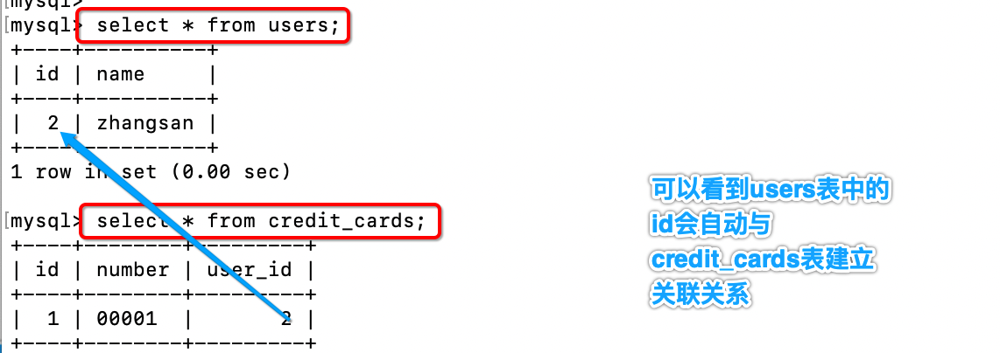
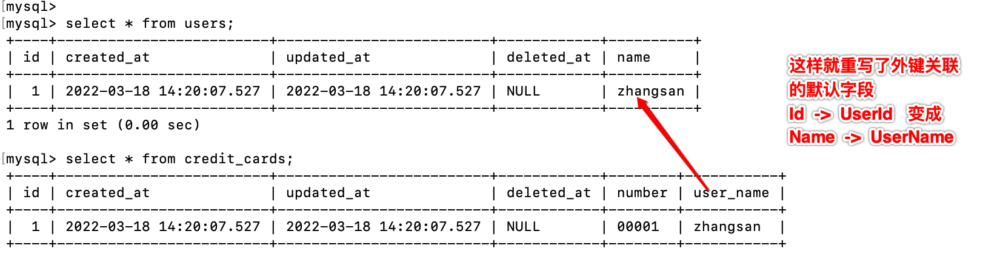
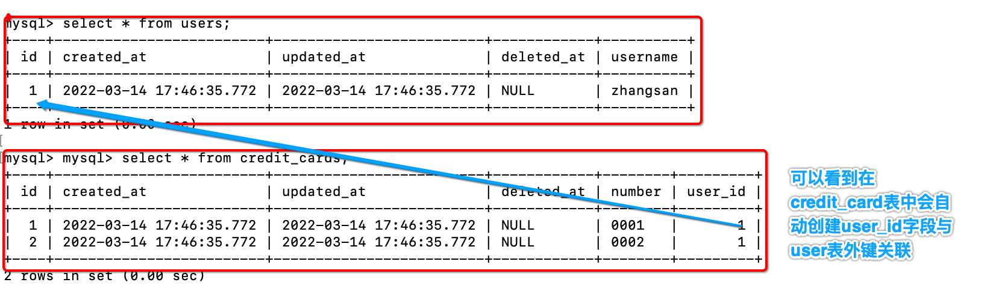
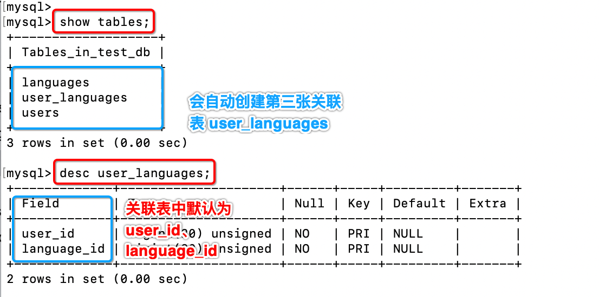
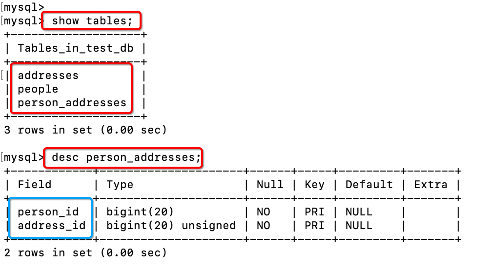

## 01.Has One

### 1.1 定义模型

- `has one` 与另一个模型建立一对一的关联，但它和一对一关系有些许不同。 
- 这种关联表明一个模型的每个实例都包含或拥有另一个模型的一个实例。

- 例如，您的应用包含 user 和 credit card 模型，且每个 user 只能有一张 credit card。

```go
package main

import (
	"gorm.io/driver/mysql"
	"gorm.io/gorm"
)

// User 有一张 CreditCard，默认 UserID 是外键
type User struct {
	ID         int64  `json:"id" gorm:"primary_key"`
	Name       string `json:"name" gorm:"not null" bind:"required"`
	CreditCard CreditCard
}

type CreditCard struct {
	ID     int64 `json:"id" gorm:"primary_key"`
	Number string
	UserID int64
}

func main() {
	// 0、连接数据库
	dsn := "root:1@tcp(127.0.0.1:3306)/test_db?charset=utf8mb4&parseTime=True&loc=Local"
	db, _ := gorm.Open(mysql.Open(dsn), &gorm.Config{})
	db.AutoMigrate(User{}, CreditCard{})

	// 1、创建关联
	user := User{
		Name: "zhangsan",
		CreditCard: CreditCard{
			Number: "00001",
		},
	}
	db.Create(&user)

	// 2、添加关联
	//db.Create(&User{Name: "lisi"})
	var u User
	db.Where("name = ?", "lisi").First(&u)
	db.Create(&CreditCard{
		Number: "00002",
		UserID: user.ID,
	})

}
```

- `生成表结构`

 

### 1.2 正向查找

```go
package main

import (
	"gorm.io/driver/mysql"
	"gorm.io/gorm"
)

// User 有一张 CreditCard，默认 UserID 是外键
type User struct {
	ID         int64  `json:"id" gorm:"primary_key"`
	Name       string `json:"name" gorm:"not null" bind:"required"`
	CreditCard CreditCard
}

type CreditCard struct {
	ID     int64 `json:"id" gorm:"primary_key"`
	Number string
	UserID int64
}

func main() {
	// 0、连接数据库
	dsn := "root:1@tcp(127.0.0.1:3306)/test_db?charset=utf8mb4&parseTime=True&loc=Local"
	db, _ := gorm.Open(mysql.Open(dsn), &gorm.Config{})
	db.AutoMigrate(User{}, CreditCard{})

	// 1、Association查找关联
	user := User{Name: "zhangsan"}
	db.First(&user)
	db.Model(&user).Association("CreditCard").Find(&user.CreditCard)
}
```

### 1.3 重写外键

```go
package main

import (
	"gorm.io/driver/mysql"
	"gorm.io/gorm"
)

type User struct {
	gorm.Model
	Name       string     `gorm:"type:varchar(100);index"`
	CreditCard CreditCard `gorm:"foreignkey:UserName;references:name"`
	// references:name        使用Name字段作为外键，而不是默认的Id
	// foreignkey:UserName    在CreditCard表中关联字段为UserName，而不是默认的UserId
}

type CreditCard struct {
	gorm.Model
	Number   string
	UserName string
}

func main() {
	// 0、连接数据库
	dsn := "root:1@tcp(127.0.0.1:3306)/test_db?charset=utf8mb4&parseTime=True&loc=Local"
	db, _ := gorm.Open(mysql.Open(dsn), &gorm.Config{})
	db.AutoMigrate(User{}, CreditCard{})

	// 1、创建关联
	user := User{
		Name: "zhangsan",
		CreditCard: CreditCard{
			Number: "00001",
		},
	}
	db.Create(&user)
}
```

- 创建表如下

 

## 02.Has Many

[更多内容到官网](https://gorm.io/zh_CN/docs/has_many.html)

### 2.1 定义

#### 1、has many介绍

- `has many` 关联就是创建和另一个模型的一对多关系

- 例如， 例如每一个用户都拥有多张信用卡，这样就是生活中一个简单的一对多关系
- 默认CreditCard中需要一个UserId字段与User表创建外键

```go
// 用户有多张信用卡，UserID 是外键
type User struct {
    gorm.Model
    CreditCards []CreditCard
}

type CreditCard struct {
    gorm.Model
    Number   string
    UserID   uint     // 默认会在 CreditCard 表中生成 UserID 字段作为 与User表关联的外键ID
}
```

#### 2、重写外键

- 为了定义一对多关系， 外键是必须存在的，默认外键的名字是所有者类型的名字加上它的主键。

- 就像上面的例子，为了定义一个属于`User` 的模型，外键就应该为 `UserID`。

- 使用其他的字段名作为外键， 你可以通过 `foreignkey` 来定制它， 例如:

```go
type User struct {
    gorm.Model
    // foreignkey:UserRefer 可以自己指定外键关联字段名为：UserRefer
    CreditCards []CreditCard `gorm:"foreignkey:UserRefer"`
}

type CreditCard struct {
    gorm.Model
    Number    string
    UserRefer uint
}
```

#### 3、重写引用

- GORM 通常使用所有者的主键作为外键的值， 在上面的例子中，它就是 `User` 的 `ID`。

- 当你分配信用卡给一个用户， GORM 将保存用户 `ID` 到信用卡表的 `UserID` 字段中。

- 你能通过 `association_foreignkey` 来改变它

```go
type User struct {
    gorm.Model
    MemberNumber string
    // 默认CreditCard会使用User表的Id作为外键，association_foreignkey:MemberNumber 指定使用 MemberNumber 作为外键关联
    CreditCards  []CreditCard `gorm:"foreignkey:UserMemberNumber;association_foreignkey:MemberNumber"`
}

type CreditCard struct {
    gorm.Model
    Number           string
    UserMemberNumber string
}
```

### 2.2 表结构定义

[参考官网](https://gorm.io/zh_CN/docs/associations.html#%E8%87%AA%E5%8A%A8%E5%88%9B%E5%BB%BA%E3%80%81%E6%9B%B4%E6%96%B0)

```go
package main

import (
	"gorm.io/driver/mysql"
	"gorm.io/gorm"
)

/*
constraint:OnUpdate:CASCADE 【当User表更新，也会同步给CreditCards】
OnDelete:SET NULL 【当User中数据被删除时，CreditCard关联设置为 NULL，不删除记录】
*/
type User struct {
	gorm.Model
	Username    string       `json:"username" gorm:"column:username"`
	CreditCards []CreditCard `gorm:"constraint:OnUpdate:CASCADE,OnDelete:SET NULL;"`
}

type CreditCard struct {
	gorm.Model
	Number string
	UserID uint
}

func main() {
	// 0、连接数据库
	dsn := "root:1@tcp(127.0.0.1:3306)/test_db?charset=utf8mb4&parseTime=True&loc=Local"
	db, _ := gorm.Open(mysql.Open(dsn), &gorm.Config{})
	// 创建表结构
	db.AutoMigrate(User{}, CreditCard{})
	
	// 1、创建一对多
	user := User{
		Username: "zhangsan",
		CreditCards: []CreditCard{
			{Number: "0001"},
			{Number: "0002"},
		},
	}
	db.Create(&user)

	// 2、为已存在用户添加信用卡
	u := User{Username: "zhangsan"}
	db.First(&u)
	//fmt.Println(u.Username)
	db.Model(&u).Association("CreditCards").Append([]CreditCard{
		{Number: "0003"},
	})
}
```

- 创建结果说明
  - 我们没有指定 foreignkey，所以会与 UserID字段自动建立外键关联关系

 

### 2.3 Association关联操作

[详情见官网](https://gorm.io/zh_CN/docs/associations.html#%E6%9F%A5%E6%89%BE%E5%85%B3%E8%81%94)

- 使用 `Association` 方法, 需要把把 `User` 查询好, 然后根据 `User` 定义中指定的 `AssociationForeignKey` 去查找 `CreditCard`

```go
package main

import (
	"fmt"

	"gorm.io/driver/mysql"
	"gorm.io/gorm"
)

/*
constraint:OnUpdate:CASCADE 【当User表更新，也会同步给CreditCards】
OnDelete:SET NULL 【当User中数据被删除时，CreditCard关联设置为 NULL，不删除记录】
*/
type User struct {
	gorm.Model
	Username    string       `json:"username" gorm:"column:username"`
	CreditCards []CreditCard `gorm:"constraint:OnUpdate:CASCADE,OnDelete:SET NULL;"`
}

type CreditCard struct {
	gorm.Model
	Number string
	UserID uint
}

func main() {
	// 0、连接数据库
	dsn := "root:1@tcp(127.0.0.1:3306)/test_db?charset=utf8mb4&parseTime=True&loc=Local"
	db, _ := gorm.Open(mysql.Open(dsn), &gorm.Config{})

	// 1、查找关联
	user := User{Username: "zhangsan"} // Association必须要先查出User才能关联查询对应的 CreditCard
	db.First(&user)
	db.Model(&user).Association("CreditCards").Find(&user.CreditCards)

	// 2、添加关联
	user := User{Username: "zhangsan"} // Association必须要先查出User才能关联查询对应的 CreditCard
	db.First(&user)
	// 2.1 批量添加
	db.Model(&user).Association("CreditCards").Append([]CreditCard{
		{Number: "0004"},
		{Number: "0005"},
	})
	// 2.2 单条添加
	db.Model(&user).Association("CreditCards").Append(&CreditCard{Number: "0006"})

	// 3、替换关联(CreditCard表中UserId字段原有关系全部重置为Null)
	user := User{Username: "zhangsan"} // Association必须要先查出User才能关联查询对应的 CreditCard
	db.First(&user)
	db.Model(&user).Association("CreditCards").Replace(&CreditCard{Number: "0010"})

	// 4、删除关联
	user := User{Username: "zhangsan"} // Association必须要先查出User才能关联查询对应的 CreditCard
	db.First(&user)
	var card CreditCard
	db.Where("number = ?", "0001").Find(&card)
	db.Model(&user).Association("CreditCards").Delete(card)

	// 5、清空关联
	user := User{Username: "zhangsan"} // Association必须要先查出User才能关联查询对应的 CreditCard
	db.First(&user)
	db.Model(&user).Association("CreditCards").Clear()

	// 6、关联计数
	user := User{Username: "zhangsan"} // Association必须要先查出User才能关联查询对应的 CreditCard
	db.First(&user)
	count := db.Model(&user).Association("CreditCards").Count()
	fmt.Println(count) // 6
}
```

### 2一对多Preload

[详情见官网](https://gorm.io/zh_CN/docs/preload.html)

- 使用 `Preload` 方法, 在查询 `User` 时先去获取 `CreditCard` 的记录

```go
package main

import (
	"encoding/json"
	"fmt"

	"gorm.io/driver/mysql"
	"gorm.io/gorm"
)

/*
constraint:OnUpdate:CASCADE 【当User表更新，也会同步给CreditCards】
OnDelete:SET NULL 【当User中数据被删除时，CreditCard关联设置为 NULL，不删除记录】
*/
type User struct {
	gorm.Model
	Username    string       `json:"username" gorm:"column:username"`
	CreditCards []CreditCard `gorm:"constraint:OnUpdate:CASCADE,OnDelete:SET NULL;"`
}

type CreditCard struct {
	gorm.Model
	Number string
	UserID uint
}

func main() {
	// 0、连接数据库
	dsn := "root:1@tcp(127.0.0.1:3306)/test_db?charset=utf8mb4&parseTime=True&loc=Local"
	db, _ := gorm.Open(mysql.Open(dsn), &gorm.Config{})

	// 1、预加载: 查找 user 时预加载相关 CreditCards
	//users := User{Username: "zhangsan"}  // 只查找张三用户的信用卡信息
	users := []User{}
	db.Preload("CreditCards").Find(&users)

	strUser, _ := json.Marshal(&users)
	fmt.Println(string(strUser))
}
```

- 查询结果

```json
[
    {
        "ID":1,
        "username":"zhangsan",
        "CreditCards":[
            {
                "ID":1,
                "Number":"0001",
                "UserID":1
            },
						...
        ]
    }
]
```

## 03.Preload预加载

[详情见官网](https://gorm.io/zh_CN/docs/preload.html)

### 3.1 创建表

```go
package main

import (
	"gorm.io/driver/mysql"
	"gorm.io/gorm"
)

type User struct {
	gorm.Model
	Username string
	Orders   []Order
}

type Order struct {
	gorm.Model
	UserID uint
	Price  float64
}

func main() {
	// 0、连接数据库
	dsn := "root:1@tcp(127.0.0.1:3306)/test_db?charset=utf8mb4&parseTime=True&loc=Local"
	db, _ := gorm.Open(mysql.Open(dsn), &gorm.Config{})
	db.AutoMigrate(User{}, Order{})

	data := []User{
		{Username: "zhangsan", Orders: []Order{
			{Price: 64.5},
			{Price: 65.2},
			{Price: 120},
		}},
		{Username: "lisi", Orders: []Order{
			{Price: 64.5},
			{Price: 68.2},
			{Price: 110},
		}},
	}
	db.Create(&data)
}
```

### 3.2 关联查询

```go
package main

import (
	"gorm.io/driver/mysql"
	"gorm.io/gorm"
)

type User struct {
	gorm.Model
	Username string
	Orders   []Order
}

type Order struct {
	gorm.Model
	UserID uint
	Price  float64
}

func main() {
	// 0、连接数据库
	dsn := "root:1@tcp(127.0.0.1:3306)/test_db?charset=utf8mb4&parseTime=True&loc=Local"
	db, _ := gorm.Open(mysql.Open(dsn), &gorm.Config{})

	// 1、查找 user 时预加载相关 Order
	//1.1 加载所有数据
	var users []User
	db.Preload("Orders").Find(&users)

	// 1.2 加载指定数据
	user := User{Username: "zhangsan"}
	db.Preload("Orders").Find(&user)

	// 2、带条件的预加载
	var users []User
	// 2.1 查找价格小于100的订单
	//db.Preload("Orders", "price < ?", "100").Find(&users)
	// 2.2 查找 用户名为zhangsan 订单价格小于 100的所有信息
	db.Where("username = ?", "zhangsan").
		Preload("Orders", "price < ?", "100").Find(&users)
}
```

## 04.Many To Many

[详情见官网](https://gorm.io/zh_CN/docs/many_to_many.html)

### 4.1 定义模型

#### 1、Many To Many

- Many to Many 会在两个 model 中添加一张连接表。

- 例如，您的应用包含了 user 和 language，且一个 user 可以说多种 language，多个 user 也可以说一种 language。
- 当使用 GORM 的 `AutoMigrate` 为 `User` 创建表时，GORM 会自动创建连接表

```go
// User 拥有并属于多种 language，`user_languages` 是连接表
type User struct {
  gorm.Model
  Languages []Language `gorm:"many2many:user_languages;"`
}

type Language struct {
  gorm.Model
  Name string
}
```

#### 2、反向引用

```go
// User 拥有并属于多种 language，`user_languages` 是连接表
type User struct {
  gorm.Model
  Languages []*Language `gorm:"many2many:user_languages;"`
}

type Language struct {
  gorm.Model
  Name string
  Users []*User `gorm:"many2many:user_languages;"`
}
```

#### 3、重写外键

- 对于 `many2many` 关系，连接表会同时拥有两个模型的外键

```go
type User struct {
  gorm.Model
  Languages []Language `gorm:"many2many:user_languages;"`
}

type Language struct {
  gorm.Model
  Name string
}

// 连接表：user_languages
//   foreign key: user_id, reference: users.id
//   foreign key: language_id, reference: languages.id
```

- 若要重写它们，可以使用标签 `foreignKey`、`references`、`joinforeignKey`、`joinReferences`。
- 当然，您不需要使用全部的标签，你可以仅使用其中的一个重写部分的外键、引用。

```go
type User struct {
    gorm.Model
    Profiles []Profile `gorm:"many2many:user_profiles;foreignKey:Refer;joinForeignKey:UserReferID;References:UserRefer;joinReferences:ProfileRefer"`
    Refer    uint      `gorm:"index:,unique"`
}

type Profile struct {
    gorm.Model
    Name      string
    UserRefer uint `gorm:"index:,unique"`
}

// 会创建连接表：user_profiles
//   foreign key: user_refer_id, reference: users.refer
//   foreign key: profile_refer, reference: profiles.user_refer
```

### 3.2 创建多对多表

```go
package main

import (
	"gorm.io/driver/mysql"
	"gorm.io/gorm"
)

// User 拥有并属于多种 language，`user_languages` 是连接表
type User struct {
	gorm.Model
	Languages []Language `gorm:"many2many:user_languages;"`
}

type Language struct {
	gorm.Model
	Name string
}

func main() {
	// 0、连接数据库
	dsn := "root:1@tcp(127.0.0.1:3306)/test_db?charset=utf8mb4&parseTime=True&loc=Local"
	db, _ := gorm.Open(mysql.Open(dsn), &gorm.Config{})
	// 1、自动创建多对多表结构
	db.AutoMigrate(
		User{},
		Language{},
	)
}
```

- 生成如下三张表

 

### 3.3 自定义第三张表

```go
package main

import (
	"time"

	"gorm.io/driver/mysql"
	"gorm.io/gorm"
)

type Person struct {
	ID        int
	Name      string
	Addresses []Address `gorm:"many2many:person_addresses;"`
}

type Address struct {
	ID   uint
	Name string
}

type PersonAddress struct {
	PersonID  int `gorm:"primaryKey"`
	AddressID int `gorm:"primaryKey"`
	CreatedAt time.Time
	DeletedAt gorm.DeletedAt
}

//func (PersonAddress) BeforeCreate(db *gorm.DB) (err error) {
//	// 修改 Person 的 Addresses 字段的连接表为 PersonAddress
//	// PersonAddress 必须定义好所需的外键，否则会报错
//	err = db.SetupJoinTable(&Person{}, "Addresses", &PersonAddress{})
//	if err != nil {
//		fmt.Println("err", err)
//	}
//	return nil
//}

func main() {
	// 0、连接数据库
	dsn := "root:1@tcp(127.0.0.1:3306)/test_db?charset=utf8mb4&parseTime=True&loc=Local"
	db, _ := gorm.Open(mysql.Open(dsn), &gorm.Config{})
	// 1、自动创建多对多表结构
	db.AutoMigrate(
		Person{},
		Address{},
	)

	// 2、添加数据
	persons := Person{
		ID:   1,
		Name: "zhangsan",
		Addresses: []Address{
			{ID: 1, Name: "bj"},
			{ID: 2, Name: "sh"},
		},
	}
	db.Create(&persons)
}
```

- 生成三张表如下

 

### 3.4 多对多Preload

```go
package main

import (
	"encoding/json"
	"fmt"
	"time"

	"gorm.io/driver/mysql"
	"gorm.io/gorm"
)

type Person struct {
	ID        int
	Name      string
	Addresses []Address `gorm:"many2many:person_addresses;"`
}

type Address struct {
	ID   uint
	Name string
}

type PersonAddress struct {
	PersonID  int `gorm:"primaryKey"`
	AddressID int `gorm:"primaryKey"`
	CreatedAt time.Time
	DeletedAt gorm.DeletedAt
}

func main() {
	// 0、连接数据库
	dsn := "root:1@tcp(127.0.0.1:3306)/test_db?charset=utf8mb4&parseTime=True&loc=Local"
	db, _ := gorm.Open(mysql.Open(dsn), &gorm.Config{})

	// 1、获取 name="zhangsan" 用户的地址
	persons := []Person{}
	db.Preload("Addresses").Find(&persons)

	strPersons, _ := json.Marshal(&persons)
	fmt.Println(string(strPersons))
	// [{"ID":1,"Name":"zhangsan","Addresses":[{"ID":1,"Name":"bj"},{"ID":2,"Name":"sh"}]}]

	// 2、获取 name="zhangsan" 用户的地址
	person := Person{Name: "zhangsan"}
	db.Preload("Addresses").Find(&person)
	strPerson, _ := json.Marshal(&person)
	fmt.Println(string(strPerson))
	// {"ID":1,"Name":"zhangsan","Addresses":[{"ID":1,"Name":"bj"},{"ID":2,"Name":"sh"}]}
}
```


