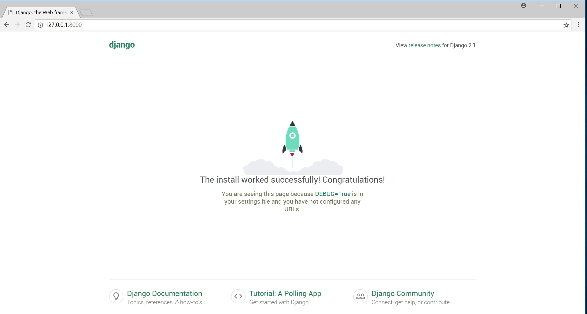
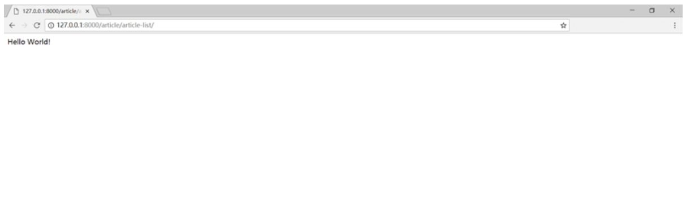
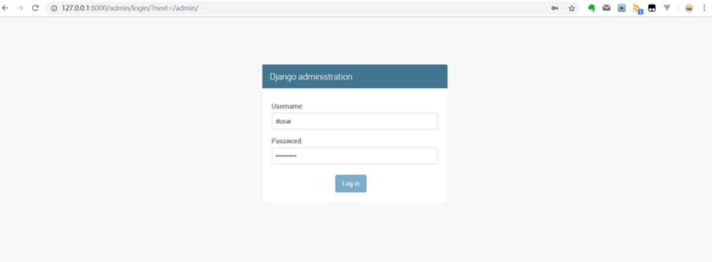
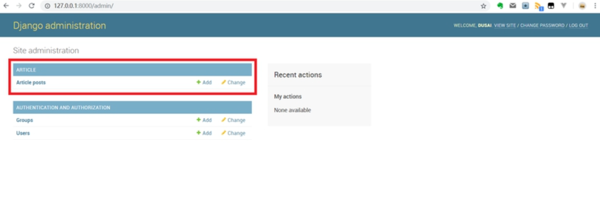
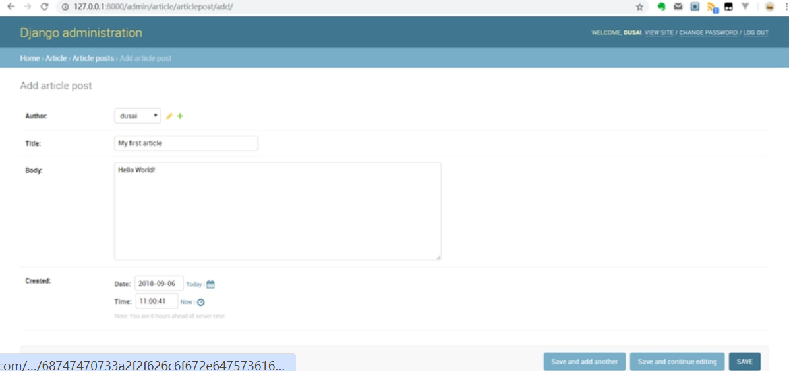
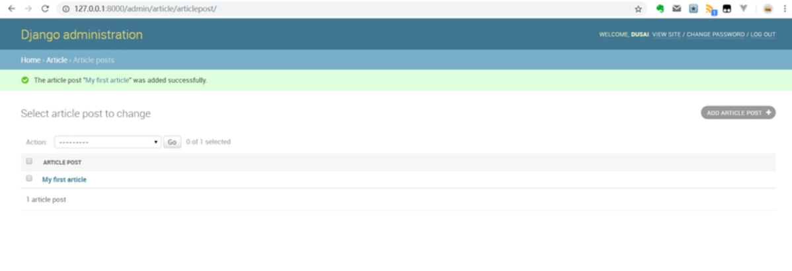
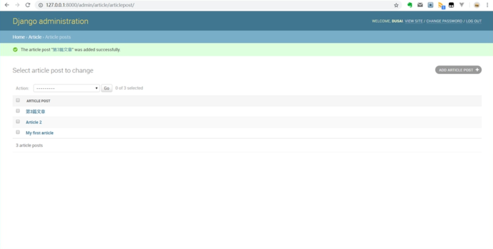
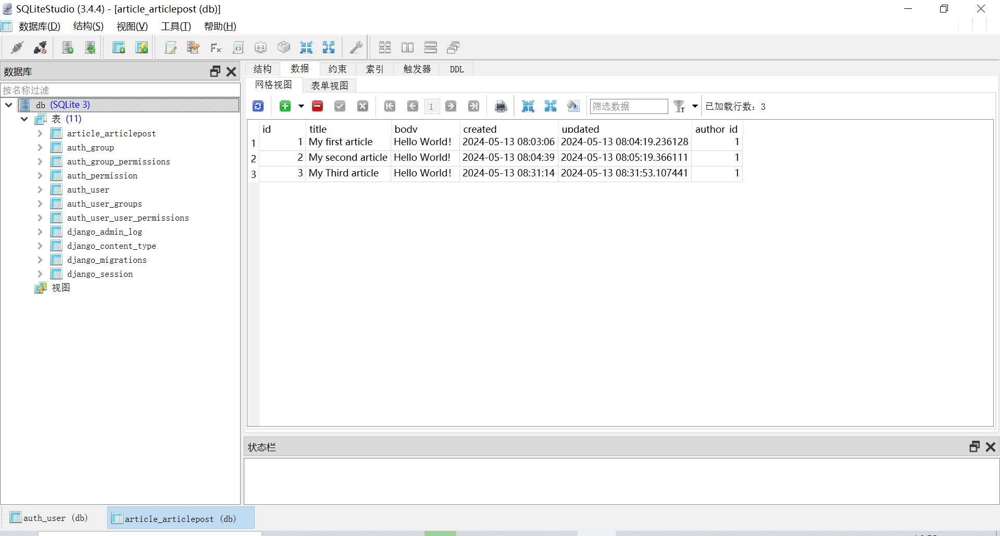

# 教程的开发环境

本教程的开发环境为：

- **Win 10（64位）**
- **Python 3.7.0**
- **Django 2.2**

为了避免开发环境不同而导致的错误，建议读者使用相同的版本。

**注意：不少读者反馈 Django 2.1 版本在后面章节中会遇到 main.auth_user_old 的报错。这是版本兼容问题造成的。因此强烈建议读者使用其他小版本号，如 Django 2.2。**

## 安装Python

python的安装为比较简单，首先找到[Python官方网站](https://www.python.org/)，选择python3.7的windows版本，下载并安装。

**安装时注意勾选添加python到环境变量中。**如果没有或者漏掉这一步，请安装完毕后自行添加。

若实在不知道怎么弄的，看这篇文章：

[windows上安装python3教程以及环境变量配置](https://blog.csdn.net/random_w/article/details/78897365)

安装完成后打开[命令行](https://jingyan.baidu.com/article/046a7b3e83a505f9c27fa9a2.html)，输入`python -V`，系统打印出python的版本号，说明安装成功了：

```
C:\Users\dusai> python -V
Python 3.7.0
```

## 配置虚拟环境

**虚拟环境（virtualenv，或venv ）**是 Python 多版本管理的利器，可以使每个项目环境与其他项目独立开来，保持环境的干净，解决包冲突问题。你可以将虚拟环境理解为一个隔绝的小系统。

**从Python3.3版本开始就自带了虚拟环境，不需要安装，配置一下就可以用了。**

新建一个文件夹，教程中为`django_project`。进入此文件夹：

```
E:\>cd django_project
E:\django_project>
```

输入配置venv的命令，其中的`env`为虚拟环境的放置目录：

```
E:\django_project> python -m venv env  
```

创建完成后，输入`env\Scripts\activate.bat`，即可进入虚拟环境：

```
E:\django_project> env\Scripts\activate.bat
(env) E:\django_project>
```

liunx

source env/bin/activate

**盘符前有`(env)`标识说明进入venv成功。**

## 安装Django

**在虚拟环境下**，输入命令`pip install django==2.2`：

```
(env) E:\django_project> pip install django==2.2

Collecting django==2.2
  Using cached 
  ...
  ...
Successfully installed django-2.2

(env) E:\django_project>
```

通过指令`pip install django==2.2`来安装和教程相同版本的 Django。

系统打印出以上文字表示Django安装成功了。

> 这里一定要指定版本号，否则就默认安装 Django 3 了。新手不要纠结版本问题，先跟着教程把基础掌握好。

## 创建Django项目

还是在**虚拟环境**下，在`django_project`文件夹中创建Django项目：

```
(env) E:\django_project>django-admin startproject my_blog
```

查看`django_project`文件夹，发现多了`my_blog`文件夹，其结构应该是这样：

```
my_blog
│  db.sqlite3
│  manage.py
│
└─my_blog
    │  settings.py
    │  urls.py
    │  wsgi.py
    └─ __init__.py
```

这就是我们刚创建出来的项目了。

## 运行Django服务器

非常幸运，Django自带一个轻量的Web开发服务器，也被叫做“runserver”。

开发服务器是为了让你快速开发Web程序，通过它可以避开配置生产环境的服务器的繁琐环节。

开发服务器会自动的检测代码的改变，并且自动加载它，因此在修改代码后不需要手动去重启服务器，非常的方便。

要运行这个django服务器，首先要进入`my_blog`文件夹，即含有`manage.py`文件的那个：

```
(env) E:\django_project>cd my_blog
(env) E:\django_project\my_blog>
```

输入命令`python manage.py runserver`：

```
(env) E:\django_project\my_blog>python manage.py runserver
Performing system checks...

System check identified no issues (0 silenced).

You have 15 unapplied migration(s). Your project may not work properly until you apply the migrations for app(s): admin, auth, contenttypes, sessions.
Run 'python manage.py migrate' to apply them.
August 20, 2018 - 17:32:34
Django version 2.2, using settings 'my_blog.settings'
Starting development server at http://127.0.0.1:8000/
Quit the server with CTRL-BREAK.
```

系统打印出这些信息，说明服务器启动成功了，打开chrome浏览器，输入http://127.0.0.1:8000/ ，即倒数第2排信息提示我们的服务器地址。看到下面的界面：

[](https://camo.githubusercontent.com/03991e354df9474750898e3648c9c87ab296df1e492aeb1f662fbb3c77647f90/68747470733a2f2f626c6f672e647573616970686f746f2e636f6d2f64757361696e65742d373030304b2f68656c6c6f5f646a616e676f5f75646f494862662e6a7067)

恭喜你，小火箭起飞，django运行起来了！

## 代码编辑器

django运行起来后，我们还需要一款**代码编辑器**或者**集成开发环境（IDE）**来编辑python文件，以达到开发需求。

市面上有很多Python的代码编辑器或者集成开发环境可以选择。

教程使用了代码编辑器**Sublime Text 3**。它不是免费的，但是可以无限期试用，所以你不需要掏腰包。

进入[Sublime Text 3官网](https://www.sublimetext.com/3)，下载对应版本的安装文件安装即可使用了。

当然你也可以根据喜好选择其他的编辑器或者开发环境：

- [10大Python集成开发环境和代码编辑器（指南）](https://blog.csdn.net/cH3RUF0tErmB3yH/article/details/80156176)
- [写python程序什么编辑器最好用？](https://www.zhihu.com/question/20476960)

## 浏览器

作为一个正经的web开发者，你的眼中应该只有[Chrome](https://www.google.com/chrome/)！

# 创建APP

**在Django中的一个app代表一个功能模块。**开发者可以将不同功能的模块放在不同的app中, 方便代码的复用。app就是项目的基石，因此开发博客的第一步就是创建新的app，用来实现跟文章相关的功能模块。

打开命令行，进入项目所在的目录：**（注意Django的操作必须在虚拟环境下进行）**

```
E:\>cd django_project
E:\django_project>
```

进入虚拟环境（忘记进入venv方法的看这里： [在Windows中搭建Django的开发环境](http://www.dusaiphoto.com/article/article-detail/4/)）：

```
 E:\django_project> env\Scripts\activate.bat
(env) E:\>
```

看到盘符前有`(env)`标识则表示进入虚拟环境成功。

输入`python manage.py startapp article`指令，创建名为`article`的app：

```
(env) E:\django_project\my_blog>python manage.py startapp article
```

查看一下`my_blog`文件夹，应该看到这样的结构：

```
my_blog
│  db.sqlite3
│  manage.py
│
├─article
│  │  admin.py
│  │  apps.py
│  │  models.py
│  │  tests.py
│  │  views.py
│  │  __init__.py
│  │
│  └─migrations
│        └─ __init__.py
│
└─my_blog
    │  settings.py
    │  urls.py
    │  wsgi.py
    └─ __init__.py
```

**项目结构**分解如下：

- 根目录`my_blog`下有两个文件：db.sqlite3是一个轻量级的数据库文件，用来存储项目产生的数据，比如博客文章；manage.py是项目执行命令的入口，比如runserver。
- 目录`article`是刚创建出来的app，用来放置博客文章相关的代码：后台管理文件`admin.py`，数据模型文件`models.py`，视图文件`views.py`，存放数据迁移文件的目录`migrations`。
- 根目录下还有一个`my_blog`目录，其中的settings.py包含项目的配置参数，urls.py则是项目的根路由文件。

目前你需要了解的就这么多，后面的章节都会用到。剩下还有一些没讲到的文件可以暂时不管它，碰到时再查资料。

## 注册APP（settings）

**接着我们需要修改项目配置文件，“告诉”Django现在有article这么一个app了。**

打开`my_blog`目录的`settings.py`，找到`INSTALLED_APPS`写入如下代码：

```Python
my_blog/settings.py

INSTALLED_APPS = [
	# 其他代码
	...
	
	# 新增'article'代码，激活app
    'article',
]
```

## 配置访问路径（urls）

**然后再给app配置访问路径url。**

url可以理解为访问网站时输入的网址链接，配置好url后Django才知道怎样定位app。

打开`my_blog`目录下的`urls.py`，增加以下代码：

```Python
my_blog/urls.py

from django.contrib import admin
# 记得引入include
from django.urls import path, include

# 存放映射关系的列表
urlpatterns = [
    path('admin/', admin.site.urls),

    # 新增代码，配置app的url
    path('article/', include('article.urls', namespace='article')),
]
```

path为Django的路由语法：

- 参数`article/`分配了app的访问路径；
- `include`将路径分发给下一步处理；
- `namespace`可以保证反查到唯一的url，即使不同的app使用了相同的url（后面会用到）。

记得在顶部引入`include`。

> 在开发环境下，article的url为：http://127.0.0.1:8000/article/

**还没结束**。现在我们已经通过`path`将根路径为`article`的访问都分发给article这个app去处理。但是app通常有多个页面地址，因此还需要app自己也有一个路由分发，也就是`article.urls`了。

> article可以有多个页面，如列表页面、详情页面等，那么就需要如下两个url：
>
> http://127.0.0.1:8000/article/list/
>
> http://127.0.0.1:8000/article/detail/
>
> app中的url.py就是用来区分它们的。

在app生成时并没有这个文件，因此需要自己在`article`文件夹中创建`urls.py`，在里面输入：

```Python
article/urls.py

# 引入path
from django.urls import path

# 正在部署的应用的名称
app_name = 'article'

urlpatterns = [
    # 目前还没有urls
]
```

`urlpatterns`中暂时是空的，没写入任何路径的映射，不着急以后会写。

此时我们的app就配置完成了。

> 注意此时app还没有写好，因此启动服务器可能会报错，是正常的。
>
> Django2.0之后，app的`urls.py`必须配置`app_name`，否则会报错。

# 编写Model

**Django 框架主要关注的是模型（Model）、模板（Template）和视图（Views），称为MTV模式。**

它们各自的职责如下：

| 层次                           | 职责                                                         |
| ------------------------------ | ------------------------------------------------------------ |
| 模型（Model），即数据存取层    | 处理与数据相关的所有事务： 如何存取、如何验证有效性、包含哪些行为以及数据之间的关系等。 |
| 模板（Template），即业务逻辑层 | 处理与表现相关的决定： 如何在页面或其他类型文档中进行显示。  |
| 视图（View），即表现层         | 存取模型及调取恰当模板的相关逻辑。模型与模板的桥梁。         |

**简单来说就是Model存取数据，View决定需要调取哪些数据，而Template则负责将调取出的数据以合理的方式展现出来。**

## 数据库与模型

**数据库**是存储电子文件的场所，储存独立的数据集合。一个**数据库**由多个**数据表**构成。

啥意思？举个栗子，三年级二班中同学们的花名册就是**数据表**。有的花名册记录每位同学的考试成绩、有的记录身高体重、还有的记录兴趣爱好...所有的这些花名册都放在老师的柜子里，这个柜子就是**“数据库”**了。

> 默认情况下，数据库就是db.sqlite3这个文件了。在网站上线后你可能想换别的数据库，不过目前我们还不需要讨论这个内容。

操作数据库使用的是复杂的SQL语句，它是完全不同于Python的另一种语言，这对新手来说无疑是困难的。

幸运的是，在 Django 里写Web应用并不需要你直接去操作数据库，而是定义好**模型**（用Python语法就可以了！），**模型**中包含了操作数据库所必要的命令。也就是说你只需要定义数据模型，其它的底层代码都不用关心，它们会自动从模型生成。

> 其实它有专门的术语，叫**对象关系映射**（**Object Relational Mapping**，简称**ORM**），用于实现面向对象编程语言里不同类型系统的数据之间的转换。

## 编写Model.py

**如前面所讲，Django中通过模型（Model）映射到数据库，处理与数据相关的事务。**

对博客网站来说，最重要的数据就是文章。所以首先来建立一个存放文章的数据模型。

打开`article/models.py`文件，输入如下代码：

```Python
article/models.py

from django.db import models
# 导入内建的User模型。
from django.contrib.auth.models import User
# timezone 用于处理时间相关事务。
from django.utils import timezone

# 博客文章数据模型
class ArticlePost(models.Model):
    # 文章作者。参数 on_delete 用于指定数据删除的方式
    author = models.ForeignKey(User, on_delete=models.CASCADE)

    # 文章标题。models.CharField 为字符串字段，用于保存较短的字符串，比如标题
    title = models.CharField(max_length=100)

    # 文章正文。保存大量文本使用 TextField
    body = models.TextField()

    # 文章创建时间。参数 default=timezone.now 指定其在创建数据时将默认写入当前的时间
    created = models.DateTimeField(default=timezone.now)

    # 文章更新时间。参数 auto_now=True 指定每次数据更新时自动写入当前时间
    updated = models.DateTimeField(auto_now=True)
```

代码非常直白。

- 每个模型都被表示为 `django.db.models.Model` 类的子类，从它继承了操作数据库需要的所有方法。

- 每个字段都是 `Field` 类的实例 。比如字符字段被表示为 `CharField` ，日期时间字段被表示为 `DateTimeField`。这将告诉Django要处理的数据类型。

- 定义某些 `Field` 类实例需要参数。例如 `CharField` 需要一个 `max_length`参数。这个参数的用处不止于用来定义数据库结构，也用于验证数据。

- 使用 `ForeignKey`定义一个关系。这将告诉 Django，每个（或多个） `ArticlePost` 对象都关联到一个 `User` 对象。

  > Django具有一个简单的账号系统（User），满足一般网站的用户相关的基本功能。

`ArticlePost`类定义了一篇文章所必须具备的要素：作者、标题、正文、创建时间以及更新时间。

我们还可以额外再定义一些内容，规范`ArticlePost`中数据的行为：

```Python
article/models.py

...

class ArticlePost(models.Model):
    ...
    
    # 内部类 class Meta 用于给 model 定义元数据
    class Meta:
    	# ordering 指定模型返回的数据的排列顺序
    	# '-created' 表明数据应该以倒序排列
        ordering = ('-created',)

    # 函数 __str__ 定义当调用对象的 str() 方法时的返回值内容
    def __str__(self):
    	# return self.title 将文章标题返回
        return self.title
```

- 内部类`Meta`中的`ordering`定义了数据的排列方式。`-created`表示将以创建时间的倒序排列，保证了最新的文章总是在网页的最上方。注意`ordering`是元组，括号中只含一个元素时不要忘记末尾的逗号。
- `__str__`方法定义了需要表示数据时应该显示的名称。给模型增加 `__str__`方法是很重要的，它最常见的就是在Django管理后台中做为对象的显示值。因此应该总是返回一个友好易读的字符串。

整理并去掉注释，全部代码放在一起是这样：

```Python
article/models.py

from django.db import models
from django.contrib.auth.models import User
from django.utils import timezone

class ArticlePost(models.Model):
    author = models.ForeignKey(User, on_delete=models.CASCADE)
    title = models.CharField(max_length=100)
    body = models.TextField()
    created = models.DateTimeField(default=timezone.now)
    updated = models.DateTimeField(auto_now=True)
    
    class Meta:
        ordering = ('-created',)
        
    def __str__(self):
        return self.title
```

**恭喜你，你已经完成了博客网站最核心的数据模型的大部分内容。**

代码不到20行，是不是完全没啥感觉。后面会慢慢体会Django的强大。

### 抄还是敲？

学习本教程时，代码部分直接拷贝还是纯手敲？

直接拷贝的优点是学得很快，理解原理后，把代码往自己项目中刷刷刷拷贝过去，几下就能运行了。但这要求学习者有较强的自律能力：什么程度才能算已经“理解”了？

纯手敲就避免了这个问题，想快也快不起来，还经常遇到bug，在解决的过程中纠正自身的习惯性问题。但是手敲的好处必须保证你敲的时候大脑没有放空。

**博主的建议是：**

- **模型**、**视图**代码量不多，又是重点学习内容，尽量纯手敲。
- **模板**根据个人情况，适当拷贝。

> 视图、模板马上就会讲到。

## 代码分解

> 这部分内容不能理解也没关系，先跳过，待水平提高再回过头来阅读。

### 导入

Django框架基于python语言，而在python中用`import`或者`from...import`来导入模块。

**模块**其实就一些函数和类的集合文件，它能实现一些相应的功能。当我们需要使用这些功能的时候，直接把相应的模块导入到我们的程序中就可以使用了。

`import`用于导入整个功能模块。但实际使用时往往只需要用模块中的某一个功能，为此导入整个模块有点大材小用，因此可以用`from a import b`表示从模块`a`中导入`b`给我用就可以了。

### 类

Python作为面向对象编程语言，最重要的概念就是**类**（Class）和**实例**（Instance）。

类是抽象的模板，而实例是根据这个类创建出来的一个个具体的“对象”。每个对象都拥有相同的方法，但各自的数据可能不同。而这些方法被打包封装在一起，就组成了类。

比如说我们刚写的这个`ArticlePost`类，作用就是就为博客文章的内容提供了一个模板。每当有一篇新文章生成的时候，都要比对`ArticlePost`类来创建`author`、`title`、`body`...等等数据；虽然每篇文章的具体内容可能不一样，但是必须都遵循相同的规则。

在Django中，数据由模型来处理，而模型的载体就是类（Class）。

### 字段

**字段**（field）表示数据库表的一个抽象类，Django使用字段类创建数据库表，并将Python类型映射到数据库。

在模型中，字段被实例化为类属性并表示特定的表，同时具有将字段值映射到数据库的属性及方法。

比方说`ArticlePost`类中有一个`title`的属性，这个属性中保存着`Charfield`类型的数据：即一个较短的字符串。

### 外键

数据库中有各种各样的数据表，有时候几张表的数据是互相关联的。比如一张表记录了所有的文章，另一张表记录了所有的用户，而文章是用户发表的，这时候这两张表就产生了关系。**外键**就是用来表示这种关系的。

而`ForeignKey`是用来解决“**一对多**”关系的。那什么又叫“一对多”？

在我们的`ArticlePost`模型中，一篇文章只能有一个作者，而一个作者可以有很多篇文章，这就是“一对多”关系。

又比如一个班级的同学中，每个同学只能有一种性别，而每种性别可以对应很多的同学，这也是“一对多”。

因此，通过`ForeignKey`外键，将`User`和`ArticlePost`关联到了一起，最终就是将博客文章的作者和网站的用户关联在一起了。

既然有“一对多”，当然也有**“一对一”（`OneToOneField `）、“多对多”（`ManyToManyField`）**。目前用不到这些外键，后面再回头来对比其差别。

> Django2.0 之前的版本外键的`on_delete`参数可以不填；Django2.0以后`on_delete`是必填项。

### 内部类

内部类`class Meta`提供模型的元数据。元数据是**“任何不是字段的东西”**，例如排序选项`ordering`、数据库表名`db_table`、单数和复数名称`verbose_name`和 `verbose_name_plural`。这些信息不是某篇文章私有的数据，而是整张表的共同行为。

要不要写内部类是完全可选的，当然有了它可以帮助理解并规范类的行为。

在`ArticlePost`中我们使用的元数据`ordering = ('-created',)`，表明了每当我需要取出文章列表，作为博客首页时，按照`-created`（即文章创建时间，负号标识倒序）来排列，保证了最新文章永远在最顶部位置。

## 数据迁移（Migrations）

编写好了Model后，接下来就需要进行数据迁移。迁移是Django对模型所做的更改传递到数据库中的方式。

**注意，每当对数据库进行了更改（添加、修改、删除等）操作，都需要进行数据迁移。**

Django的迁移代码是由模型文件自动生成的，它本质上只是个历史记录，Django可以用它来进行数据库的滚动更新，通过这种方式使其能够和当前的模型匹配。

在虚拟环境中进入`my_blog`文件夹（还没熟悉venv的再温习: [在Windows中搭建Django的开发环境](http://www.dusaiphoto.com/article/article-detail/4/)），输入`python manage.py makemigrations`，对模型的更改创建新的迁移表：

```
(env) e:\django_project\my_blog>python manage.py makemigrations
Migrations for 'article':
  article\migrations\0001_initial.py
    - Create model ArticlePost

(env) e:\django_project\my_blog>
```

通过运行 `makemigrations` 命令，Django 会检测你对模型文件的修改，并且把修改的部分储存为一次迁移。

然后输入`python manage.py migrate`，**应用迁移到数据库中**：

```
(env) e:\django_project\my_blog>python manage.py migrate
Operations to perform:
  Apply all migrations: admin, article, auth, contenttypes, sessions
Running migrations:
  Applying contenttypes.0001_initial... OK
  ...
  Applying sessions.0001_initial... OK

(env) e:\django_project\my_blog>
```

`migrate` 命令选中所有还没有执行过的迁移并应用在数据库上，也就是将模型的更改同步到数据库结构上。迁移是非常强大的功能，它能让你在开发过程中持续的改变数据库结构而不需要重新删除和创建表。它专注于使数据库平滑升级而不会丢失数据。

> 有点拗口，也有点枯燥，坚持。乐趣在后面。

**再重复一次**：每当你修改了`models.py`文件，都需要用`makemigrations`和`migrate`这两条指令迁移数据。

在迁移之后，Model的编写就算完成了。

# View视图初探

数据库虽然已经有了，但是用户通常只需要这个庞大数据库中的很小一部分进行查看、修改等操作。为此还需要代码来恰当的取出并展示数据，这一部分代码就被称为**视图**。

Django 中视图的概念是**「一类具有相同功能和模板的网页的集合」**。比如，在一个博客应用中，你可能会创建如下几个视图：

- 博客首页：展示最近的几项内容。
- 内容“详情”页：详细展示某项内容。
- 评论处理器：用于响应为一项内容添加评论的操作。

这些需求都靠**视图（View）**来完成。

## Hello World!

首先写一个最简单的**视图函数**，在浏览器中打印出`Hello World!`字符串。

打开`article/views.py`，写出视图函数：

```python
article/views.py

# 导入 HttpResponse 模块
from django.http import HttpResponse

# 视图函数
def article_list(request):
    return HttpResponse("Hello World!")
```

**网页都是从视图派生而来。**每一个视图表现为一个简单的Python函数，它必须要做的只有两件事：返回一个包含被请求页面内容的 `HttpResponse`对象，或者抛出一个异常，比如 `Http404` 。至于你还想干些什么，随便你。

视图函数中的`request`与网页发来的请求有关，里面包含**get**或**post**的内容、用户浏览器、系统等信息。Django调用`article_list`函数时会返回一个含字符串的 `HttpResponse`对象。

有了视图函数，还需要配置**URLconfs**，将用户请求的URL链接关联起来。换句话说，URLconfs的作用是将URL映射到视图中。

在[前面的文章](https://www.dusaiphoto.com/article/article-detail/6/)中已经将URL分发给了`article`应用，因此这里只需要修改之前添加的`article/urls.py`就可以。添加以下代码：

```python
article/urls.py

# 引入views.py
from . import views

...

urlpatterns = [
    # path函数将url映射到视图
    path('article-list/', views.article_list, name='article_list'),
]
```

**Django 将会根据用户请求的 URL 来选择使用哪个视图。**本例中当用户请求`article/article-list`链接时，会调用`views.py`中的`article_list`函数，并返回渲染后的对象。参数`name`用于反查url地址，相当于给url起了个名字，以后会用到。

测试一下刚才敲的代码是否工作正常。

**在虚拟环境中**，进入项目目录，也就是`my_blog`文件夹，输入`python manage.py runserver`，运行调试服务器：

```
(env) E:\django_project\my_blog>python manage.py runserver

Performing system checks...

System check identified no issues (0 silenced).
August 30, 2018 - 19:41:00
Django version 2.1, using settings 'my_blog.settings'
Starting development server at http://127.0.0.1:8000/
Quit the server with CTRL-BREAK.
```

成功运行后，打开浏览器，输入url地址`http://127.0.0.1:8000/article/article-list/`，其中`127.0.0.1:8000`是调试服务器的本地地址，`article`是项目路由`my_blog\urls.py`分发的地址，`article-list`是刚才配置的`article\urls.py`应用分发的地址。

运气好的话，浏览器中会打印出`Hello World!`字符串：



不到10行代码就完成了基本功能，是不是很神奇。

当然，只是小试牛刀。

## 准备工作

在章节[编写Model模型](https://www.dusaiphoto.com/article/article-detail/11/)中虽然定义了数据库表，但是这个表是空的，不方便展示View调取数据的效果。所以在写View之前，需要往数据表里记录一些数据。接下来就做这个工作。

### 网站后台概念

**网站后台**，有时也称为**网站管理后台**，是指用于管理网站的一系列操作，如：数据的增加、更新、删除等。在项目开发的初期，因为没有真实的用户数据和完整的测试环境，会频繁地使用后台修改测试数据。

Django内置了一个很好的后台管理工具，只需要些少量代码，就可以实现强大的功能。

### 创建管理员账号（Superuser）

管理员账号（Superuser）是可以进入网站后台，对数据进行维护的账号，具有很高的权限。这里我们需要创建一个管理员账号，以便添加后续的测试数据。

**虚拟环境**中输入`python manage.py createsuperuser`指令，创建管理员账号：

```
(env) E:\django_project\my_blog>python manage.py createsuperuser
Username: dusai
Email address: dusaiphoto@foxmail.com
Password:
Password (again):
Superuser created successfully.
```

指令会提示你输入账号名字、邮箱和密码，根据喜好填入即可。

### 将ArticlePost注册到后台中

接下来我们需要“告诉”Django，后台中需要添加`ArticlePost`这个数据表供管理。

打开`article/admin.py`，写入以下代码：

```python
article/admin.py

from django.contrib import admin

# 别忘了导入ArticlerPost
from .models import ArticlePost

# 注册ArticlePost到admin中
admin.site.register(ArticlePost)
```

这样就简单的注册好了。

### 在后台中遨游

细心的同学可能已经发现，Django项目生成的时候就自动配置好了后台的settings和url，因此不需要我们再操心了。

启动server，在浏览器中输入`http://127.0.0.1:8000/admin/`，一切正常的话就看到下面的登录界面了：



输入刚才创建的管理员账号，登录进去：



红框内就是刚才添加的`ArticlePost`数据表，点击进入后，再点击右上角的`ADD ARTICLE POST`按钮，到达如下页面：



仔细看一下表单中的每一项，发现与`ArticlePost`中的字段完全符合；因为`updated`字段指定了自动添加，这里就没显示了。

将表单填好后，点击保存：



可以看到ARTICLE POST中多了刚才录入的一条数据。按照同样的方法，再写入几条数据：



至此准备工作就已经大功告成。

## 检视数据库

> 2018-10-29 新增内容

通过上面的操作，我们的数据库中已经有1条用户数据、3条文章数据了。有的时候我需要检查数据库中的数据是否正确，但是项目中的数据库文件`db.sqlite3`又无法直接打开，怎么办呢？

这时候就需要用到专门处理SQLite数据文件的软件了：[SQLiteStudio](https://sqlitestudio.pl/index.rvt)

下载并安装，用它打开`db.sqlite3`，软件导航栏中就出现了数据库中保存的各类数据列表。比如说auth_user就是用户数据表了：



你可以用它检查项目代码中数据库的操作是否正常，这在开发阶段是非常实用的。


